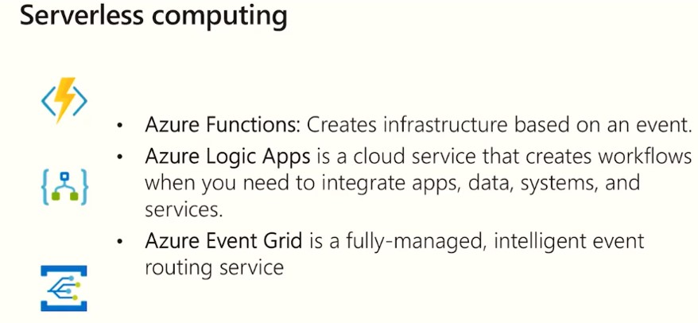
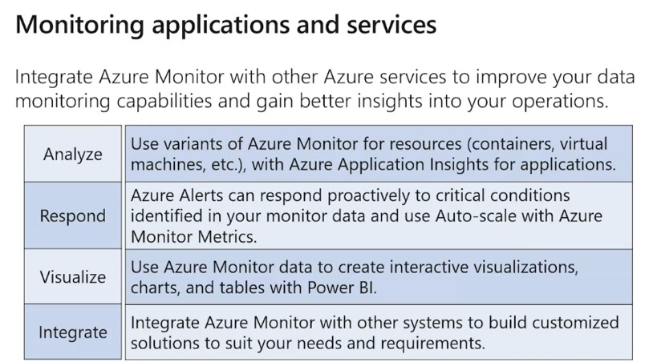
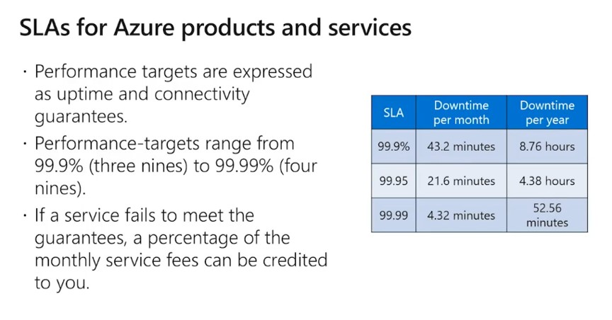

# Certification areas

--
# Module 1

## Why cloud

- High availability
- Scalability
- Elasticity
  - Scale out and in.
  - Scale up and down.
  - Dynamic scalability.
- Agility
  - Do things first.
  - Running things in minutes.
- Fault tolerance
  - Pysical problem is cloud provider's responsibility.
  - Disaster recovery.
  - Share responsibity between customers and Azure.

## Features

1. 56 regions in the world.
2. Olympics online game uses Azure Data Center.
3. Predicative cose for budget.
4. Cloud and Security
   - How I put it and how the cloud provider save it?
   - DDoS protection is default for every service and free.
5. Economies of scale
   - Less expensive
   - More effoicient
   - Pass benefits on
6. CapEx(Capital Expenditure,資本支出)
   - Deduct the expense from ur tax bill.
   - High upfront cose, value of investment reduces over time.
   - Dont worry about the hardware since cloud provider will take care of it.
7. OpEx(Operational Expenditure,運營支出)
   - No upfront cose, pay as you use.
8. Consumption-based model
   - No upfront cost.
9. Types of cloud
   - Public cloud
   - Private cloud
   - Hybrid cloud:
     - Combines public and private clouds.
     - On-prem AD sync to Azure AD for Office365 usage.
   
   

10. Types of Services
   All of the following servers can talk to each other.
   - SaaS
     - Prdicative cost.
   - PaaS
     - Build the solution or buy the solution.
   - IaaS
     - Flexible.

   

   When do you use SaaS, PaaS, IaaS? think "Pizza as a Service".

   

--
# Module 2 - Azure Core Services

## Regions

1. A regions is a collection of Data Centers.
2. It gives us flexibity and scalibility.
3. Some of regions of different resources.
4. Pick the regions closing to the end users.
5. Customer chooses the regions, not cloud provider.
6. Regions are paired, and can be failed-over. One pair must in the same geography.
7. Facilities have isolated cooling, power, firewall and networking.

## Zones and Sets

1. Data centers have updates, the update can be by Zones and Sets.
2. Isolation bundary.
3. 3 webservers on the same region, but Azure will put each of them in the different zone. MS doesn't update the 3 zones in the same time. (Fault and update tolerence).

## Resource Groups

1. Every resource lives in a Resource Group.
2. The resouces in a resource group lives with same life cycle and same region.
3. Hoerarchy: HereManagement groups -> Subscriptions -> Resource groups -> Resources.
4. Security by role-based authorization.
 

## Virtual Machine Services

- Azure VMs
- VM scale sets
- App services
- Functions

## Azure Portal

1. Use the search panel to search the available resources.
2. Preview product(s) doesn't have SLA.
3. Tutorials about creating VM:
   - Event Log monitor is optional, it will use some storage.
   - You can always change the Size of a VM.
   - Custom Script: run some scripts after the VM created.
   - The process of creation can be saved as a template(JSON file) for later creating the same-spec VM.
   - Bastion service: connect to a public-ip VM with first authentication.

## Container Services

- Azure Container Service
- AKS

## Azure Newwork Services

- Azure Virtual Network
- Azure Load Balance
- VPN Gateway
- Azure Application Gateway
- Content Delivery Network
- VNet Peering

## Connectivity

- ExpressRoute Connect from on-prem to Azure.

## Azure Data Categories

1. Structure data
2. Semi-structure data
3. Unstructure data

## Azure Storage Services

### IaaS

- Disks
- Files

### PasS

- Containers
- Tables
- Queues

### Create a storage account tutorial

1. Got to **Storage Account**
2. Storage type:
   - Hot:
   - Cold
3. Replication: notice the traffice cost copying the data between regions (eager traffice).

## Database server

### SQL Server

- Its a PaaS service.
- Azure has migration data.

## Azure Marketplace

## Azure IOT

- Monitor IOT devices
- Bidirection communication

## Big Data and Analytics

- Azure Synapse Analytics
  - Cloud-based Enterprise Data Warehouse.
  - Massively parallel processing (mpp).
- Azure HDInsight
  - Fully-managed, open-source analytics service.
  - Easier, faster, cost-effective.
- Azure Data Lake Analytics
  - On-demand ananlytics service.

## Azure AI

- Machine Learning Service
  - Develop, train, test, deploy, manage and track machine learning mopdels.
- Machine Learning Studio
  - Drag-n-drop visual workspace.
  - Build, test amd deploy machine learning solutions.

## Severless Computing

- Azure Functions
- Azure Logic App
- Event Grid

## DevOps Services

- Azure DevOps services
  - Pipelines
  - Git repositories
  - Kanban boards
  - Load testing
- Azure DevTest lab
  - Quickly create environments
  - Controlling costs

## App Service

## Azure Management Tools

- Auzre Portal
- Azure Powershell
- Azure CLI
- Cloud shell: command can be stored
- Powershell
  - `get-command`
  - `get-help update-azvm`

--
# Module 3

## Authentication vs Authorization

> Authentication:
> - Establish an identity.
> - Chanllenges access for credentials.

> Authorization
> - Assumes successfil authentication.
> - Establishs appropriate level of access.

- Authorization happens after Authentication
- Azure Active Directory
  - SSO
  - Application Management
  - B2B, B2C
  - Device management
  - Azure AD uses SAML, OAuth.
- Azure AD vs AD
  - Azure AD doesn't have GPO, use InTune instead.
  - AD use Query OU path
- You can use Azure AD on AWS, Salesforce, Dropbox, etc.
- Azure Multi-Factor Authentication
  - Bad thing is that you will forget your real password in the end.

## Secure network connectivity

1. Perimeter layer
   - Protect boundaries from DDoS
2. Networking layer

## Azure firewall

## Azure Distributed Denial of Service (DDoS) protection

## Network Security Groups (NSGs)

Filters network traffic to/from.

## Application Security Groups (ASGs)

Provides server groups with similar port filtering requirements.

### Example for inbound security rule

- Web server to DB server.
- Who you are and where you what to go.
- Set the priority, for example set the allow rule  before the deny.
- Network Watcher
  - It will tell you what is going on.
  - IP Allow Verify.
  - Rules with diagram.
- Set the deny-any rule on the last rule.

## Azure Security Center

### Key Vault

1. Choose the vault credentials
2. The speaker shows how to use the secret from key vault to recover the DB.

## Azure Information Protection (AIP)

## Azure Advanced Threat Protecton (ATP)

- Identify, detecting and investment.
- Identify Protection, such as concurrent signin from America and Japan.

## Governance policy

### Azure policies

- How to control people uses Azure.
- Implement policies
  - Initialize definitions.
  - Initialize assignments.
  - Review the evaluation results.
- Role-based access control (RBAC)
  - Enable allowing/disallowing accessing to Azure Portal and controlling resources.
  - Resource groups

### Resource locks

- Protect the resources
- No cost
- Options:
  - CanNotDelete
  - ReadOnly (For example, Cannot poweroff the VM cus the property changes)
- Turn it on at resource's **Lock** option.

## Azure Blueprints  

- Create reusable environment definitions.

## Subscription Governance

## Tags

- Metadata for resources.
- Logically organizes resources into a taxonomy(分類).
- Name-value pair.
- Very useful for rolling up billing information.

## Azure Monitor

- Collect and analysics.
- Montoring applications and services.
- Azure Service Health

## Azure Service Health

## Azure Advisor

- Free.
- Suggest you to use small size VM if utilization is less than 30%.
- Help you save money.
- Operational Excellence
  - Create health aleart

## Microsoft and ITAR

- Check the doc: Azure Compliance Offering
- Azure China 23Vianet

--
# Module 4 - Pricing

## Subscriptions

- Authention and authorization to Azure accounts.
- Provide billing n access control boundaries.
- An account can have one or more subscriptions.

## Management Groups

## Subscriptions offers

- Free
  - Search "Free service" on Azure Portal.
- Pay as you go
- Enterprise Agreement
- Student
- An account can have multiple subscriptions

## Planning and management

-Depends on
 - Enterprise
 - CSP
 - Web direct

- Pricing based on
  - Regions (different location and region matters)
  - Resource type
  - Service

### Zones for billing purpose

### Pricing calclator

- Prepay, e.q. I need ten D2 machines for 3 years reservation.
  But if you want to cancel or upgrade the machines, there be a small amount of penalty.
- Hybrid benefit: if you already have on-prem Windows Server, SQL Server license.
- Minimizing costs.

### TCO calculator

- Calculate the total price on Azure vs On-prem.

## Azure Cost Management

## Support plan options

### Open a support request

- Azure Portal: Help + Support
- On resource >> New support request

### Other resources

## SLA

## Service lifecycle

1. Private Preview
2. Public Preview
3. Genernally available

- See the roadmap of Azure updates.

--
# Questions

1. First thing to create in Azure?
  - Resource group: A single management unit.
2. Cannot find my resource?
   - The resource might in the other region.
3. Service Message Block(SMB)

--
# Reference

- [Master the basics of Azure: Fundamentals](aka.ms/azfunpath)
- `folks` are much used by speekers.
