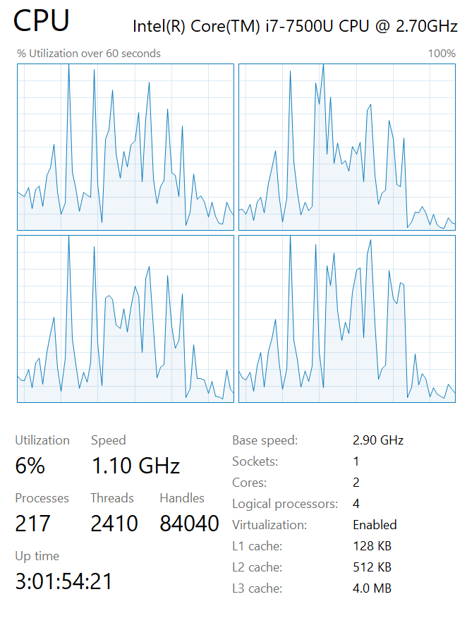

# CPU Bound or I/O Bound

The OS will handle the I/O Bound works, such as access the database.
Async is suitable for CPU Bound job which is more than 5 million seconds, such as resource-consuming works.
Threads is a limited resource.

# Concurrent computing vs Parallel computing

- Concurrent computing

Multiple works whcih are computed in the same time and are interleaved execution.

- Parallel computing

Multiple works runs on different CPU in the same time.

# Problems

> Example: F1 change tires by more than 10 people

1. Fire and forget : A bad idea in some cases.
2. The main thread disappears and no one can get the result of the distributed threads.
3. The distributed thread returns result to the wrong main thread.
4. IIS is concurrent environment, but ASP.NET is default a sync environment.
5. Async-Await is easy to write, but we cannot directly get the state of the concurrent threads.


Usual problems in CSharp:

- Cannot catch the exception of concurrent job
- TPL (Task Parallel Library) and TAP (Task Asynchronous Pattern)
- Windows application hangs (UI thread is blocked)
- Is concurrent methods use threads? CPU Bound: Yes, I/O Bound: not always
- Dont use Sync designing in Async methods
- Async is not useful for Web Server CPU 100%. Its suitable for Web Server 50% but users feel slow performance. 


> Learning Async is for Performance and Responsive time

# Design

1. Async means **I'll call you backl**.
2. Notify the main thread: Success/Failure/Progress.
3. Improve the performance and Responsive time.
4. `Lock` too much codes is low performance.
5. IIS default can have 2,500 requests and 1,000 request queue. The 3,501 request will get 503 server error. 
6. Async-Await is Syntactic sugar, it uses Task(TAP) in the underlying structure.
7. .NET Core will use Async in default.
8. HttpClient is Thread-safe, can be static at async environment.
9. Task.Wait() can results in DeadLock in some cases. Await won't block caller's thread.
10. `return await Task.FromResult("xxxxx")` won't create a new thread, and it ok in calling non-async methods in async method.
11. Do not create:
    - async void MyMethod(): Fire and forget, cannot get the status and exception of the thread even if it crashes!
    - async string MyMethod(): Not returning Task! 
12. Async can make good use of CPU and enable more concurrent requests in the same time in ASP.NET
13. `Task.WaitAll()` will return `AggregateException`, `Task.WhenAll()` will return `Exception` with index 0.


### Hyper Threading: 

Sockets: 1
Cors: 2
Logical processors: 4

1 CPU, 2 Cors and can run 4 scripts by hyper threading in the same time.

> 1. 1 CPU is suggested to have 2 threads or will be slow for [Context Switching]
> 2. Process Explorer




# Foreground thread vs Background thread

> Reference: [Foreground and Background Threads](https://docs.microsoft.com/en-us/dotnet/standard/threading/foreground-and-background-threads)

In C#, use [Thread.IsBackground](https://docs.microsoft.com/en-us/dotnet/api/system.threading.thread.isbackground?view=netframework-4.7.2).

If the main program has been aborted, but any foreground thread has not completed, the main program will not be aborted immediately and will wait the foreground thread completes the work.

On the other hand, if the background thread has not completed the work, once the main program stops and all the backgounrd threads will be terminated immediately.

> `Task.Run()` cannot create a Foreground thread, but `Thread` class can.


## PLINQ

```
var list = new int[]{1,2,3,4,5}
var plist = from p in a.AsParallel()
            select p;
// The order of plist depends on the assigned schedule of every CPU
```


## Promise Task 

- Often used in IO bound jobs
- If using an old .NET framework not supporting Task, we can use this way to return Task.


## SychronizationContext

 1. GUI 類型專案的同步內容將會為 UI/Main 執行緒
 2. ASP.NET 類型專案的同步內容將會為當時HTTP請求的執行緒
  
| Frameworks | SychronizationContext | Content in SychronizationContext |
|:-----------|:----------------------|:------:|
| Windows Form | UI Thread (WindowsFormsSynchronizationContext) | UI thread | 
| WPF | UI Thread (DispatcherSynchronizationContext) | UI thread  |
| ASP.NET | AspNetSynchronizationContext | Current Http request's thread  | 
| Console | No | - |
| ASP.NET Core | No | - |


## ConfigureAwait(false)

This method is used for not using the **SychronizationContext** .
Which will increase the performance 


# Reference

- (Book)Threading and CSharp
- Bechmark .NET
- ILSpy